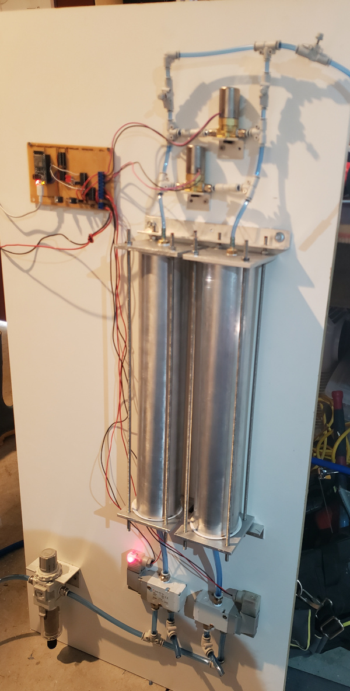
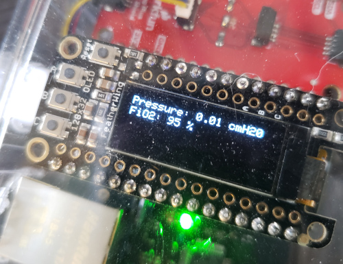
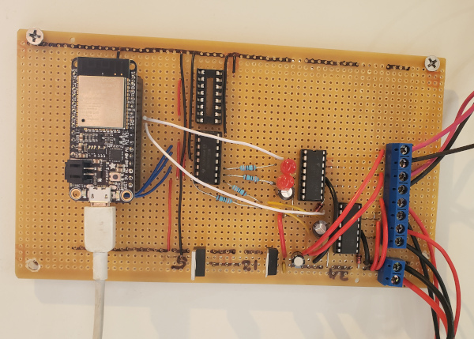
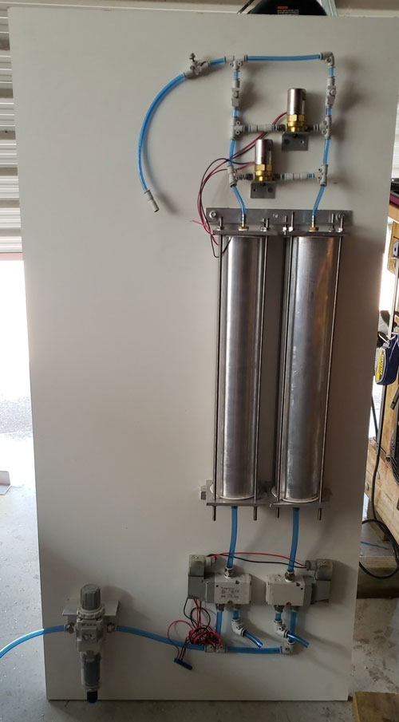
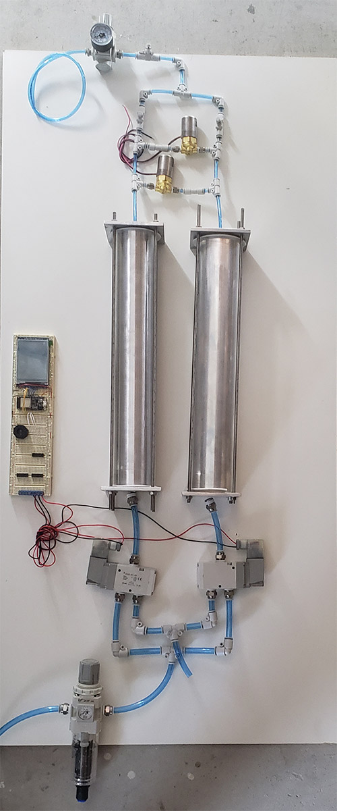

# Public Invention Oxygen Concentrator

## Introduction

Medical grade oxygen is an essential component of respiratory therapy. Typically this is provided by industrial scale cryogenic oxygen concentrators. The COVID-19 pandemic has highlighted the existing need for medical oxygen in field hospital settings around the world. These settings create a variety of challenges that need to be overcome to deliver oxygen to communities around the world.

Human resources are be limited both medically and technically. Medical staff communicate in a variety of local languages and may have little experience. Staff to patient ratios are much higher than is acceptable in a fully equipped hospital. Technical support staff face challenges such as lack of training and basic maintenance equipment.

Field hospital settings may be urban or rural. Environments such as high temperatures, high humidity and fine dust particles create engineering challenges.

Infrastructure and logistics create additional challenges. This is raised the requirement to design a device that can be manufactured locally, along with sufficient documentation to present to local regulatory authorities. Medical device standards must be met and this project aims to meet regulatory requirements.

[Download](docs/PIOC.pdf) the PIOC 1 page presentation!

# Project Status

**1 November 2020**

It's alive! Running for the first time PIOC reached 95% O2! VentMon is being used to monitor the O2 output, pressure and flowrate. Unfortunately the single stage water filter let enough water vapour past that after a few hours the concentration dropped to 35% - the water separator was half full with a small puddle underneath it. PIOC has been made by hand without much effort to be exacting as to test the idea of manufacturing in an automotive or small engineering workshop - tolerances are +-millimeters not fractions of a millimeter. Next steps are to dry out the zeolite and build a simple chiller and dessicant drier to remove any excess water vapour - some digital pressure sensors will then be installed to tune the system and test various configurations.

**22 October 2020**

The system is now mounted to the board! Some changes have been made during the build to simplify it - the sieves now use 1/4" NPT barb fittings as a step towards making an all metal "sealed for life" sieve that can be heated to 300C to regenerate the zeolite without opening the sieves. Standardizing the end plates also helps to make manufacturing easier and remove the need to drill and tap 3/8" BSPT which is costly and requires a drill press. The pneumatic circuit has been modified to shorten the overall height. The valves have been tested manually and the overall operation appears to be correct. Next steps are to finish the driver circuits and fill the sieves.

**19 October 2020**

First build is almost ready for testing! Parts of the system have been tested independently. Next is to complete assembly for a full pressure test. Then fill the sieves with zeolite and start tuning the control system.

## Project Structure

Please see subdirectories for relevant files and documentation.

## Thanks

Many thanks to [Project Apollo](https://github.com/oxycon/ProjectApollo), [Helpful Engineering](https://helpfulengineering.org/), [Shield Mission OxiKit](https://oxikit.com/) and [EnAccess OpenO2](https://enaccess.org/projects/openo2/) for their ongoing collaboration.
